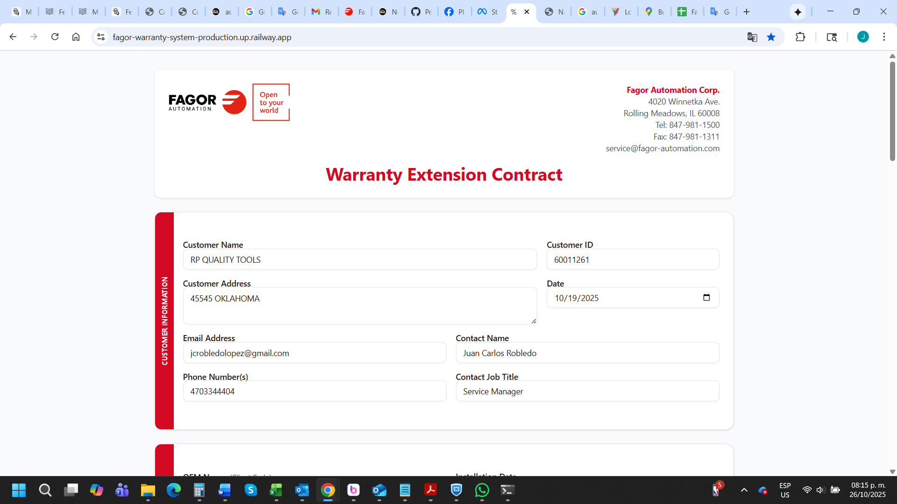

# Training Request Workflow Guide
## Guía del Flujo de Trabajo de Solicitud de Capacitación

---

  

    
  

  

    <strong>FAGOR AUTOMATION Corp.</strong> 
    4020 Winnetta Ave 
    Rolling Meadows, IL 60008 
    Tel: 847-981-1500 
    Fax: 847-981-1311 
    service@fagor-automation.com
  

---

## English Version

### Overview

The FAGOR Training Request System streamlines the process of scheduling on-site CNC training for your team. This guide outlines each step from initial request to confirmed training dates.

---

### Step-by-Step Workflow

#### **Step 1: Submit Training Request**

The client begins by completing the online training request form with the following information:

**Company Information**
- Company name, contact person, email, phone number
- Complete facility address (street, city, state, ZIP code)
- OEM information (if applicable)

**Machine & Training Details**
- CNC controller model (8055, 8065, 8070, etc.)
- Machine brand and model
- Machine type and programming requirements
- Number of training days requested (1-5 days)
- Number of participants
- Current knowledge level of trainees
- Special requirements or topics to cover

**Acceptance & Signature**
- Review and accept terms and conditions
- Provide digital signature
- Submit request

**System Action:** Upon submission, the system automatically:
- Generates a unique reference code (format: DDMMYY-HHMM-XXXX)
- Assigns the nearest qualified technician based on location
- Calculates comprehensive quotation including:
  - Training costs (first day + additional days)
  - Travel time costs
  - Travel expenses (flight, hotel, car rental, meals)
- Sends email notifications to FAGOR team and assigned technician

---

#### **Step 2: Review Quotation**

The client receives an instant, detailed quotation displaying:

**Training Costs**
- First day training rate: $1,400
- Additional days: $1,000 per day
- Training subtotal

**Travel Time**
- Flight hours + driving hours × 2 (round trip)
- Calculated at $110 per hour
- Travel time subtotal

**Travel Expenses**
- Round-trip flight to nearest international airport
- Hotel accommodation ($130 per night)
- Car rental ($58 per day)
- Meals and incidentals ($68 per day, GSA rate)
- Travel expenses subtotal

**Additional Information**
- Interactive map showing route from airport to facility
- Assigned technician name and office location
- Unique reference code for tracking

**Client Decision:** Review all costs and details, then either:
- Accept the quotation and proceed to date selection
- Contact FAGOR for questions or modifications

---

#### **Step 3: Select Training Dates**

After accepting the quotation, the client selects preferred training dates:

**Date Selection Process**
1. Choose desired training start date
2. System automatically calculates end date based on training days
3. System checks availability in real-time against Google Calendar

**Availability Scenarios**

**Scenario A: Dates Available** ✅
- Green indicator confirms dates are free
- Client can proceed to confirm selection

**Scenario B: Dates Unavailable** ❌
- Red indicator shows conflicts
- System automatically suggests 3 alternative available dates
- Client can select from suggestions or choose different dates

**Confirmation**
- Client confirms selected dates
- System creates calendar event with "Pending Confirmation" status (YELLOW)
- Client receives acknowledgment that dates are pending approval

---

#### **Step 4: FAGOR Review & Approval**

FAGOR team reviews the pending training request:

**Internal Review**
- Verify technician availability
- Confirm travel arrangements feasibility
- Review any special requirements
- Check calendar for final conflicts

**Approval Process**
- FAGOR admin opens Google Calendar
- Locates the pending event (marked in YELLOW)
- Reviews all training details in event description
- If approved: Changes event color to GREEN
- If changes needed: Modifies dates and sets to GREEN

**System Monitoring**
- Background service checks calendar every 5 minutes
- Automatically detects color change from YELLOW to GREEN
- Updates database status to "Confirmed"
- Triggers automatic confirmation email

---

#### **Step 5: Automatic Confirmation**

When FAGOR approves the training (changes calendar event to GREEN), the system automatically:

**Immediate Actions**
1. Detects approval within 5 minutes
2. Updates training status to "Confirmed"
3. Records confirmed dates in database
4. Sends professional confirmation email to client

**Confirmation Email Includes**
- ✓ CONFIRMED badge with confirmed dates
- Reference code
- Company and training details
- Training duration and CNC controller model
- Assigned technician information
- Next steps for preparation
- FAGOR contact information

**Client Receives**
- Professional email confirmation
- Clear display of confirmed training dates
- Technician contact information
- Preparation guidelines

---

#### **Step 6: Pre-Training Preparation**

**Client Responsibilities**
- Ensure all equipment is operational and ready
- Prepare list of specific questions or topics
- Arrange workspace for training activities
- Confirm participant attendance

**FAGOR Actions**
- Assigned technician contacts client 24-48 hours before training
- Confirms arrival time and logistics
- Discusses any last-minute details or questions

---

#### **Step 7: Training Delivery**

**On Training Days**
- Technician arrives at scheduled time
- Conducts comprehensive on-site training
- Covers requested topics and controller operations
- Answers questions and provides hands-on guidance
- Adapts training to team's knowledge level

**Training Completion**
- Technician provides summary of topics covered
- Offers additional resources or follow-up support
- Client receives training completion documentation

---

### Date Change Scenarios

**If FAGOR Needs to Change Dates**

1. FAGOR admin modifies dates in Google Calendar
2. Sets event color to GREEN to confirm new dates
3. System automatically detects date change
4. Sends updated confirmation email to client with new dates
5. Client reviews and accepts new dates via email

**If Client Needs to Change Dates**

1. Client contacts FAGOR via email or phone
2. FAGOR team checks availability for requested new dates
3. Updates calendar accordingly
4. System sends new confirmation once approved

---

### Key Features & Benefits

**Automated Efficiency**
- Instant quotation generation
- Real-time availability checking
- Automatic date conflict detection
- Smart alternative date suggestions

**Transparent Pricing**
- Detailed cost breakdown
- No hidden fees
- Clear travel expense calculations
- Interactive route mapping

**Seamless Communication**
- Automatic email notifications
- Professional confirmation emails
- Real-time status updates
- Direct technician contact before training

**Quality Assurance**
- Qualified technician assignment based on location
- Comprehensive training coverage
- Flexible scheduling with conflict prevention
- Professional documentation throughout process

---

### Support & Contact

For questions or assistance at any stage:

**Email:** service@fagor-automation.com  
**Phone:** 847-981-1500  
**Fax:** 847-981-1311

**Business Hours:** Monday - Friday, 8:00 AM - 5:00 PM CST

---

---

## Versión en Español

### Descripción General

El Sistema de Solicitud de Capacitación de FAGOR optimiza el proceso de programación de capacitación CNC en sitio para su equipo. Esta guía describe cada paso desde la solicitud inicial hasta las fechas de capacitación confirmadas.

---

### Flujo de Trabajo Paso a Paso

#### **Paso 1: Enviar Solicitud de Capacitación**

El cliente comienza completando el formulario de solicitud de capacitación en línea con la siguiente información:

**Información de la Empresa**
- Nombre de la empresa, persona de contacto, correo electrónico, número de teléfono
- Dirección completa de las instalaciones (calle, ciudad, estado, código postal)
- Información del OEM (si aplica)

**Detalles de la Máquina y Capacitación**
- Modelo del controlador CNC (8055, 8065, 8070, etc.)
- Marca y modelo de la máquina
- Tipo de máquina y requisitos de programación
- Número de días de capacitación solicitados (1-5 días)
- Número de participantes
- Nivel de conocimiento actual de los participantes
- Requisitos especiales o temas a cubrir

**Aceptación y Firma**
- Revisar y aceptar términos y condiciones
- Proporcionar firma digital
- Enviar solicitud

**Acción del Sistema:** Al enviar, el sistema automáticamente:
- Genera un código de referencia único (formato: DDMMAA-HHMM-XXXX)
- Asigna el técnico calificado más cercano según la ubicación
- Calcula una cotización integral que incluye:
  - Costos de capacitación (primer día + días adicionales)
  - Costos de tiempo de viaje
  - Gastos de viaje (vuelo, hotel, renta de auto, comidas)
- Envía notificaciones por correo electrónico al equipo de FAGOR y al técnico asignado

---

#### **Paso 2: Revisar Cotización**

El cliente recibe una cotización instantánea y detallada que muestra:

**Costos de Capacitación**
- Tarifa del primer día de capacitación: $1,400
- Días adicionales: $1,000 por día
- Subtotal de capacitación

**Tiempo de Viaje**
- Horas de vuelo + horas de conducción × 2 (viaje redondo)
- Calculado a $110 por hora
- Subtotal de tiempo de viaje

**Gastos de Viaje**
- Vuelo redondo al aeropuerto internacional más cercano
- Alojamiento en hotel ($130 por noche)
- Renta de automóvil ($58 por día)
- Comidas e incidentales ($68 por día, tarifa GSA)
- Subtotal de gastos de viaje

**Información Adicional**
- Mapa interactivo que muestra la ruta desde el aeropuerto hasta las instalaciones
- Nombre del técnico asignado y ubicación de la oficina
- Código de referencia único para seguimiento

**Decisión del Cliente:** Revisar todos los costos y detalles, luego:
- Aceptar la cotización y proceder a la selección de fechas
- Contactar a FAGOR para preguntas o modificaciones

---

#### **Paso 3: Seleccionar Fechas de Capacitación**

Después de aceptar la cotización, el cliente selecciona las fechas preferidas de capacitación:

**Proceso de Selección de Fechas**
1. Elegir la fecha de inicio deseada para la capacitación
2. El sistema calcula automáticamente la fecha de finalización según los días de capacitación
3. El sistema verifica la disponibilidad en tiempo real contra Google Calendar

**Escenarios de Disponibilidad**

**Escenario A: Fechas Disponibles** ✅
- El indicador verde confirma que las fechas están libres
- El cliente puede proceder a confirmar la selección

**Escenario B: Fechas No Disponibles** ❌
- El indicador rojo muestra conflictos
- El sistema sugiere automáticamente 3 fechas alternativas disponibles
- El cliente puede seleccionar de las sugerencias o elegir fechas diferentes

**Confirmación**
- El cliente confirma las fechas seleccionadas
- El sistema crea un evento en el calendario con estado "Confirmación Pendiente" (AMARILLO)
- El cliente recibe confirmación de que las fechas están pendientes de aprobación

---

#### **Paso 4: Revisión y Aprobación de FAGOR**

El equipo de FAGOR revisa la solicitud de capacitación pendiente:

**Revisión Interna**
- Verificar disponibilidad del técnico
- Confirmar viabilidad de arreglos de viaje
- Revisar requisitos especiales
- Verificar el calendario para conflictos finales

**Proceso de Aprobación**
- El administrador de FAGOR abre Google Calendar
- Localiza el evento pendiente (marcado en AMARILLO)
- Revisa todos los detalles de capacitación en la descripción del evento
- Si se aprueba: Cambia el color del evento a VERDE
- Si se necesitan cambios: Modifica las fechas y establece en VERDE

**Monitoreo del Sistema**
- El servicio en segundo plano verifica el calendario cada 5 minutos
- Detecta automáticamente el cambio de color de AMARILLO a VERDE
- Actualiza el estado de la base de datos a "Confirmado"
- Activa el correo electrónico de confirmación automático

---

#### **Paso 5: Confirmación Automática**

Cuando FAGOR aprueba la capacitación (cambia el evento del calendario a VERDE), el sistema automáticamente:

**Acciones Inmediatas**
1. Detecta la aprobación dentro de 5 minutos
2. Actualiza el estado de capacitación a "Confirmado"
3. Registra las fechas confirmadas en la base de datos
4. Envía un correo electrónico de confirmación profesional al cliente

**El Correo de Confirmación Incluye**
- ✓ Insignia de CONFIRMADO con fechas confirmadas
- Código de referencia
- Detalles de la empresa y capacitación
- Duración de la capacitación y modelo del controlador CNC
- Información del técnico asignado
- Próximos pasos para la preparación
- Información de contacto de FAGOR

**El Cliente Recibe**
- Confirmación profesional por correo electrónico
- Visualización clara de las fechas de capacitación confirmadas
- Información de contacto del técnico
- Pautas de preparación

---

#### **Paso 6: Preparación Previa a la Capacitación**

**Responsabilidades del Cliente**
- Asegurar que todo el equipo esté operativo y listo
- Preparar lista de preguntas o temas específicos
- Organizar espacio de trabajo para actividades de capacitación
- Confirmar asistencia de participantes

**Acciones de FAGOR**
- El técnico asignado contacta al cliente 24-48 horas antes de la capacitación
- Confirma hora de llegada y logística
- Discute detalles o preguntas de último minuto

---

#### **Paso 7: Entrega de la Capacitación**

**Durante los Días de Capacitación**
- El técnico llega a la hora programada
- Realiza capacitación integral en sitio
- Cubre temas solicitados y operaciones del controlador
- Responde preguntas y proporciona orientación práctica
- Adapta la capacitación al nivel de conocimiento del equipo

**Finalización de la Capacitación**
- El técnico proporciona resumen de temas cubiertos
- Ofrece recursos adicionales o soporte de seguimiento
- El cliente recibe documentación de finalización de capacitación

---

### Escenarios de Cambio de Fechas

**Si FAGOR Necesita Cambiar las Fechas**

1. El administrador de FAGOR modifica las fechas en Google Calendar
2. Establece el color del evento en VERDE para confirmar las nuevas fechas
3. El sistema detecta automáticamente el cambio de fecha
4. Envía correo electrónico de confirmación actualizado al cliente con las nuevas fechas
5. El cliente revisa y acepta las nuevas fechas por correo electrónico

**Si el Cliente Necesita Cambiar las Fechas**

1. El cliente contacta a FAGOR por correo electrónico o teléfono
2. El equipo de FAGOR verifica disponibilidad para las nuevas fechas solicitadas
3. Actualiza el calendario en consecuencia
4. El sistema envía nueva confirmación una vez aprobado

---

### Características y Beneficios Clave

**Eficiencia Automatizada**
- Generación instantánea de cotizaciones
- Verificación de disponibilidad en tiempo real
- Detección automática de conflictos de fechas
- Sugerencias inteligentes de fechas alternativas

**Precios Transparentes**
- Desglose detallado de costos
- Sin cargos ocultos
- Cálculos claros de gastos de viaje
- Mapeo interactivo de rutas

**Comunicación Fluida**
- Notificaciones automáticas por correo electrónico
- Correos electrónicos de confirmación profesionales
- Actualizaciones de estado en tiempo real
- Contacto directo con el técnico antes de la capacitación

**Garantía de Calidad**
- Asignación de técnico calificado según ubicación
- Cobertura integral de capacitación
- Programación flexible con prevención de conflictos
- Documentación profesional durante todo el proceso

---

### Soporte y Contacto

Para preguntas o asistencia en cualquier etapa:

**Correo Electrónico:** service@fagor-automation.com  
**Teléfono:** 847-981-1500  
**Fax:** 847-981-1311

**Horario de Atención:** Lunes - Viernes, 8:00 AM - 5:00 PM CST

---

  
© 2025 FAGOR AUTOMATION Corp. All rights reserved.

  
This document is confidential and proprietary to FAGOR AUTOMATION Corp.

